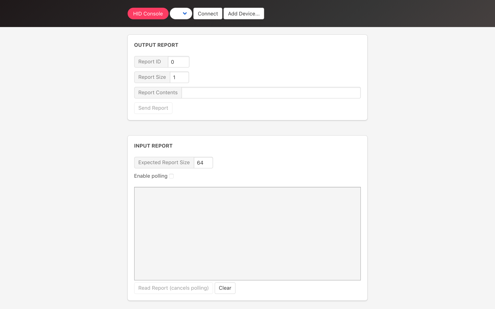

HID Console App
=====================

Send and Receive HID reports.
The HID Device must have this information: (`VID: 1155`, `PID: 22352`).

## APIs

* [HID](https://developer.chrome.com/apps/hid)
* [Runtime](https://developer.chrome.com/apps/runtime)
* [Window](https://developer.chrome.com/apps/app_window)

## Screenshot

